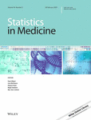
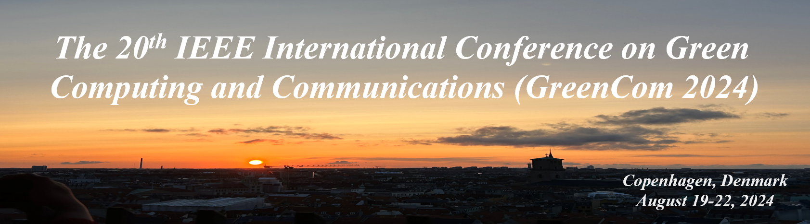
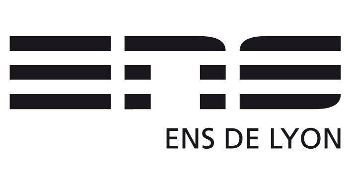
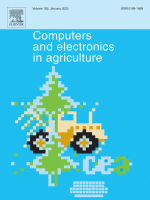
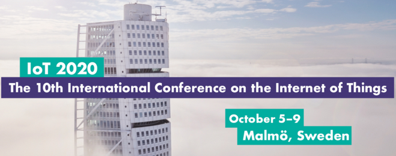

# Publications

### 2025

    

        
    

    

        <h3 class="publication-title">
            <a href="https://onlinelibrary.wiley.com/doi/10.1002/sim.70026" target="_blank" rel="noopener" class="publication-link">
                A Novel Approach to Assess the Predictiveness of a Continuous Biomarker in Early Phases of Drug Development
            </a>
        </h3>
        
Statistics in Medicine

        
Serra, A., Geronimi, J., Guilleminot, S., Hadjur, H., Riviere, M.-K., Saint-Hilary, G. and Mozgunov, P.

        
2025

        

            <a href="https://onlinelibrary.wiley.com/doi/10.1002/sim.70026" target="_blank" rel="noopener" class="tag tag-arxiv">DOI (Open Access)</a>
            <a href="https://github.com/aspapercode/predVal" target="_blank" rel="noopener" class="tag tag-github">GITHUB</a>
            Continuous Biomarker
            Early Phase
            Personalized Medicine
            Predictive
        

    

### 2024

    

        
    

    

        <h3 class="publication-title">
            <a href="https://inria.hal.science/hal-04708697v1/document" target="_blank" rel="noopener" class="publication-link">
                Deep Reinforcement Learning for Energy-efficient Selection of Embedded Services at the Edge
            </a>
        </h3>
        
IEEE International Conferences on Internet of Things (iThings)

        
Hugo Hadjur, Doreid Ammar, and Laurent Lefèvre

        
2024

        

            <a href="https://inria.hal.science/hal-04708697v1/document" target="_blank" rel="noopener" class="tag tag-arxiv">HAL</a>
            Deep Reinforcement Learning
            Internet of Things
            Task Selection
            Edge Computing
            Energy-Harvesting Systems
        

    

### 2023

    

        
    

    

        <h3 class="publication-title">
            <a href="https://inria.hal.science/hal-04091575v1/document" target="_blank" rel="noopener" class="publication-link">
                Services Orchestration at the Edge and in the Cloud on Energy-Aware Precision Beekeeping Systems
            </a>
        </h3>
        
PAISE 2023, 5th Workshop on Parallel AI and Systems for the Edge, IPDPS Workshop

        
Hugo Hadjur, Doreid Ammar, and Laurent Lefèvre

        
2023

        

            <a href="https://inria.hal.science/hal-04091575v1/document" target="_blank" rel="noopener" class="tag tag-arxiv">HAL</a>
            Precision Beekeeping
            Internet of Things
            Energy Efficiency
            Edge-Cloud Computing
            Artificial Intelligence
        

    

    

        
    

    

        <h3 class="publication-title">
            <a href="/files/manuscript.pdf" target="_blank" rel="noopener" class="publication-link">
                Designing and modeling sustainable, autonomous, smart, and energy efficient Internet of Things systems, applied to precision beekeeping
            </a>
        </h3>
        
PhD Thesis

        
Hugo Hadjur

        
2023

        

            <a href="/files/manuscript.pdf" target="_blank" rel="noopener" class="tag tag-arxiv">Manuscript</a>
            Artificial Intelligence
            Reinforcement Learning
            Internet of Things
            Energy Conservation
            Precision Beekeeping
            Literature Review
            Distributed Systems
        

    

### 2022

    

        
    

    

        <h3 class="publication-title">
            <a href="https://www.liebertpub.com/doi/10.1089/cyber.2021.0340" target="_blank" rel="noopener" class="publication-link">
                Natural Language Content Mediates the Association Between Active Interactions on Social Network Services and Subjective Well-Being
            </a>
        </h3>
        
Cyberpsychology, Behavior, and Social Networking

        
Kazuma Mori, Hugo Hadjur, and Masahiko Haruno

        
2022

        

            <a href="https://www.liebertpub.com/doi/10.1089/cyber.2021.0340" target="_blank" rel="noopener" class="tag tag-arxiv">DOI (Open Access)</a>
            Social Media
            Natural Language
        

    

    

        
    

    

        <h3 class="publication-title">
            <a href="https://inria.hal.science/hal-03483914v2/document" target="_blank" rel="noopener" class="publication-link">
                Toward an intelligent and efficient beehive: A survey of precision beekeeping systems and services
            </a>
        </h3>
        
Computers and Electronics in Agriculture

        
Hugo Hadjur, Doreid Ammar, and Laurent Lefèvre

        
2022

        

            <a href="https://inria.hal.science/hal-03483914v2/document" target="_blank" rel="noopener" class="tag tag-arxiv">HAL</a>
            Precision Beekeeping
            Literature Review
            Honey Bee
            Smart Agriculture
            Internet of Things
            Artificial Intelligence
        

    

### 2020

    

        
    

    

        <h3 class="publication-title">
            <a href="https://arxiv.org/abs/2010.14934" target="_blank" rel="noopener" class="publication-link">
                Analysis of Energy Consumption in a Precision Beekeeping System
            </a>
        </h3>
        
IoT '20: Proceedings of the 10th International Conference on the Internet of Things

        
Hugo Hadjur, Doreid Ammar, and Laurent Lefèvre

        
2020

        

            <a href="https://arxiv.org/abs/2010.14934" target="_blank" rel="noopener" class="tag tag-arxiv">arXiv</a>
            Internet of Things
            Energy Consumption
            Benchmarking
            Precision Agriculture
        

    

